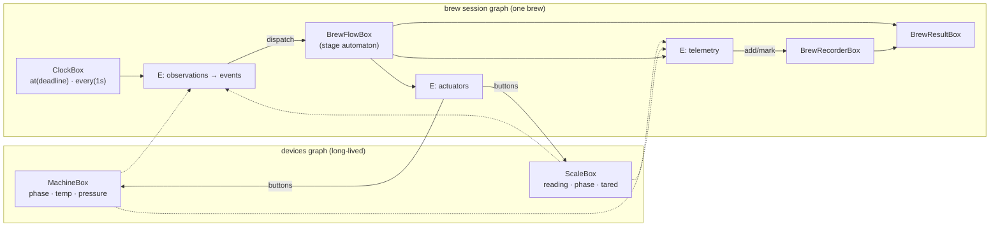

# Brew by wire — a coffee application modeled on Blackbox

**Status: modeling session (2026-09-01), not field-proven.** This is a
full application model built from existing primitives; nothing here
graduates to ARCHITECTURE.md until an implementation pays for it. The
session's method was the point: find the smallest model that fits the
library as it is, and change the library only where the model genuinely
cannot be spelled.

The verdict up front: **zero mandatory library changes.** Devices,
process, observation and result all land on existing entities. Two
optional candidates surfaced: a `Pipeline` completion predicate
(still deferred) and a clock — which the field claimed the same day
(a UI stopwatch must tick without pumping the graph) and which became
`ClockBox` in core 0.10.10.

---

## The four levels → library entities

| domain level | library entity | owns |
|---|---|---|
| device (machine, scale) | `MultiBox` behind a BLE port | hardware truth (cells) |
| brew process | a **session graph** + one state-machine box | brew progression |
| observation | wires + effects | nothing — it translates |
| result | a fold (`Box` with record input) | nothing — it projects |

And the four vocabulary questions the domain keeps asking:

| domain concept | spelling |
|---|---|
| step / state | output of `BrewFlowBox` (and a device's `phase` cell) |
| continuously observed value | a `ChildCell` of a device + a wire |
| event | a value with a `seq`, or a `BrewEvent` through `dispatch` |
| transition condition | an effect diffing observations → dispatches an event |
| command to another component | an effect diffing the step → presses a device button |

---

## Level 1 — Devices

A device is a `MultiBox` behind a pure-Dart gateway (ports and
adapters). Cells are what the hardware reports; buttons are intent.
Truth flows up, intent flows down, and they never impersonate each
other (**no optimism**: `machine.phase` moves only when the device
moved).

```dart
final class ScaleBox extends MultiBox<ScaleConnection?> {
  // continuous observations — cells; born ready, so absence is a value
  late final reading = child<ScaleReading?>(null); // (weight, timestamp, flowRate, stable)
  late final phase   = child(ScalePhase.disconnected);
  // discrete occurrences — values with a sequence number
  late final tared       = child<({int seq})?>(null);
  late final flowStopped = child<({int seq, double weight})?>(null);

  @override
  void compute(ScaleConnection? conn) {
    if (conn == null) { dispatch(phase, ScalePhase.disconnected); return; }
    connect(conn.readings, reading, map: _toReading);
    connect(conn.events, tared, map: _toTare);       // adapter absorbs the lies
    dispatch(phase, ScalePhase.ready);
  }

  void tare() => input?.tare();                      // button: intent down
}
```

```dart
final class MachineBox extends MultiBox<MachineConnection?> {
  late final phase       = child<MachinePhase?>(null); // value, not enum subclassing
  late final temperature = child<double?>(null);
  late final pressure    = child<double?>(null);

  void startProgram(MachineProgram p) { ... }          // buttons
  void stop() { ... }
}
```

Two decisions that keep the device level to two classes total:

- **A device's flow is data, not a subclass.** A machine's step
  sequence with parameters and transition rules is a `MachineProgram`
  value (steps, temperatures, durations, advance rules) delivered as
  input. `MachinePhase` is a value (`MachinePhase('preinfusion2')`),
  not an enum per vendor. One `MachineBox` runs any machine; variance
  lives in the adapter and the program — the same move as "debug is
  data".
- **Cells are born ready** (see ARCHITECTURE, Flows), so "no reading
  yet" and "disconnected" are spoken by the cells themselves — a
  nullable `reading` and an explicit `phase` — never inferred from a
  gate that will not hold.

Devices live in a **long-lived graph** (the app's, or a dedicated
devices graph): a BLE link survives between brews. Brews come and go
below them.

There is no timer device in the MVP. Time is delivered: readings carry
timestamps, and the chart is weight over the timestamps it arrived
with. The clock has exactly one owner — `ClockBox` (below).

## Level 2 — The brew session

**There is no `Process` entity.** A brew is a graph with a session
lifetime, assembled by a composition function (Floor 3 module), that
*borrows* the devices: reads their cells over cross-graph wires (lazily
registered, drawn dashed on the map — the owner outlives its readers by
construction) and commands their buttons from its effects (commanding
is legal; reacting outside your input is not).

The brew's own progression is one state machine, spelled the canonical
way — a cell, a pure `next(state, event)`, a `dispatch` button:

```dart
final class BrewFlowBox extends NoInputBox<BrewStep> {
  BrewFlowBox(Recipe recipe) : _step = ... ;
  late final _step = state<BrewStep>(BrewStep.initial(recipe));

  @override
  BrewStep compute(void _) => _step.value;

  void dispatch(BrewEvent e) => _step.value = next(_step.value, e);
}
```

It is an automaton, not a stateless fold, because the flow is
path-dependent: a temperature dip during extraction must not slide the
step back to heating. Every trigger is an event; observations become
events in effects; user confirmations are `dispatch` calls from the UI.

**The recipe is data**, and this is where the combinatorics the domain
threatens us with ("machine-only", "scale-only", "machine+scale",
manual, closed-loop, espresso, pour-over) collapse into values:

```dart
class Recipe { final List<BrewStage> stages; ... }

class BrewStage {
  final StageId id;              // weighBeans, tare, heating, extracting, settling…
  final AdvanceRule advance;     // byUser | byTime(d) | byMachinePhase(id)
                                 // | byWeight(g) | byScaleEvent(kind) | bySettled(window)
  final AdvanceRule? fallback;   // e.g. byTime(d) when the scale is lost mid-stage
  final Duration? maxDuration;   // hard safety deadline — always advances to Stopping
  final DeviceAction? onEnter;   // machineStart(program) | machineStop | scaleTare | none
}
```

`next()` is an interpreter: an event advances the automaton only if it
satisfies the current stage's `advance` (or its `fallback`, once the
required device is gone). Espresso and pour-over are different stage
lists; manual mode is the same stages with `advance: byUser`;
machine-only drops the `byWeight` stages; scale-only has no machine
`DeviceAction`s. **No class per combination exists.**

## Level 3 — Observation

The step is a **projection of observations, not their controller**.
Advancing the step unsubscribes nothing: the scale keeps pumping, the
recorder keeps appending — which is exactly why "target reached at
36 g" and "the cup is still gaining weight" coexist without ceremony.

Accumulated telemetry is the one place that needs memory:
`BrewRecorderBox` (`NoInputBox`, state cells `samples`/`marks`, buttons
`add`/`mark`) with **one writer** — the telemetry effect. This is the
sanctioned feedback ring: a result of the session's own computation,
needed back, is memory. The samples cell holds a growing list — either
append immutably or declare `distinct: false`; growth is bounded by one
brew.

The clock has one owner: **`ClockBox`** (in core since 0.10.10 — this
model's `StageClock` observer, promoted the moment the field asked for
a per-reader schedule). A self-driven node in the session graph; the
schedule lives in the subscription:

- the time effect wires `clock.at(deadline)` for every
  known-in-advance boundary — `byTime` durations, the stage's
  `maxDuration`, the settling quiet window — and dispatches each
  firing as an event (`TimeUp`, `HardDeadline`, `Settled`);
- deadlines are computed from *delivered* timestamps (`enteredAt` +
  duration, last drip + window) — never from `now()`;
- the sliding quiet window costs nothing extra: each drip re-keys
  `at(lastDrip + window)`; a stale alarm fires into an input the
  dedup guard absorbs, because the wire already points at the newer
  key;
- the UI stopwatch subscribes to `clock.every(1s)` via
  `listen`/`BoxObserver` — widgets rebuild, the graph never hears it.

Time is delivered, never read — `next()` and every compute stay pure.

## Level 4 — Result

```dart
final class BrewResultBox
    extends Box<({BrewStep step, BrewRecord record}), BrewResult?> {
  BrewResultBox.late();

  @override
  BrewResult? compute(i) => switch (i.step) {
    Finished(:final finalWeight, :final endedAt, :final aborted) =>
        BrewResult.assemble(i.record, finalWeight, endedAt, aborted: aborted),
    _ => null,
  };
}
```

"The result must not drive the flow" is topology, not discipline: no
wire leaves `result` backwards, and `toMermaid()` proves it. An aborted
brew still assembles a result (marked `aborted`) — the data was real.

A brew history lives one floor up (an app-graph `HistoryBox`); one
session effect calls `history.add(result)` on the first non-null
result — commanding a foreign button, legal and visible.

## Extraction, frame by frame

1. The automaton is in `Extracting` (brought there by
   `MachinePhaseReached(extraction)` from the machine-phase effect).
2. `scale.reading` pumps at 5–10 Hz → the telemetry effect diffs
   `(step, reading, temperature, pressure)` and calls
   `recorder.add(sample)` while `step.isRecording`.
3. The condition effect diffs `(step, reading)`: the weight crossing
   `recipe.targetYield` upward (edge via `previous`) →
   `flow.dispatch(TargetReached(w))`.
4. `next()` → `Stopping`; the actuator effect sees the stage change →
   `machine.stop()`. Once, edge-triggered — the decision is state, the
   effect merely executes it.
5. The machine really stops; `machine.phase` reports it. The automaton
   is already in `Settling` and **the scale was never told anything** —
   frame 2 continues, drips land on the chart.
6. The settling quiet window (`clock.at(lastDrip + window)`, re-keyed
   on every drip) expires → `dispatch(Settled(finalWeight))` → `Finished`
   → `result` emits `BrewResult` → session graph is disposed; the
   devices live on.

## The session, on one screen

```dart
Graph<Recipe> startBrew({
  required Recipe recipe,
  required ScaleBox? scale,      // borrowed; null = machine-only brew
  required MachineBox? machine,  // borrowed; null = scale-only brew
  required HistoryBox history,
}) {
  final flow     = BrewFlowBox(recipe);
  final recorder = BrewRecorderBox();
  final result   = BrewResultBox.late();
  final clock    = ClockBox();                       // owns every Timer

  final b = Graph.builder<Recipe>(context: recipe)
    .add(flow)
    .addMultiBox(clock)                              // self-driven
    .add(recorder)
    .add(result, input: (d) => (
      step:   d.onlyWhenReady(flow),
      record: d.onlyWhenReady(recorder),
    ))
    // actuators — the only writers of the devices
    .addEffect<BrewStep>((d) => d.onlyWhenReady(flow), run: (cur, prev) {
      if (cur.stage.id == prev?.stage.id) return;
      switch (cur.stage.onEnter) {
        case MachineStart(:final program): machine?.startProgram(program);
        case MachineStop():                machine?.stop();
        case ScaleTare():                  scale?.tare();
        case null:                         break;
      }
    })
    // history — written once, on the first assembled result
    .addEffect<BrewResult?>((d) => d.onlyWhenReady(result), run: (cur, prev) {
      if (cur != null && prev == null) history.add(cur);
    });

  // observation → events; wired only for devices that exist
  if (machine != null) {
    b.addEffect<MachinePhase?>((d) => d.onlyWhenReady(machine.phase),
      run: (cur, prev) {
        if (cur != null && cur != prev) flow.dispatch(MachinePhaseReached(cur));
      });
  }
  if (scale != null) {
    b.addEffect<({BrewStep step, ScaleReading? r, ScalePhase ph})>(
      (d) => (
        step: d.onlyWhenReady(flow),
        r:    d.onlyWhenReady(scale.reading),
        ph:   d.onlyWhenReady(scale.phase),
      ),
      run: (cur, prev) {
        final rule = cur.step.stage.advance;
        if (rule is ByWeight && crossedUp(prev?.r, cur.r, rule.grams)) {
          flow.dispatch(TargetReached(cur.r!.weight));
        }
        if (cur.step.stage.id == StageId.extracting &&
            firstRise(prev?.r, cur.r)) {
          flow.dispatch(FirstDrop(cur.r!.timestamp));
        }
        if (cur.ph == ScalePhase.disconnected &&
            prev?.ph != ScalePhase.disconnected) {
          flow.dispatch(ScaleLost());          // next() falls back per stage
        }
      });
    b.addEffect<({int seq})?>((d) => d.onlyWhenReady(scale.tared),
      run: (cur, prev) {
        if (cur != null && cur.seq != prev?.seq) flow.dispatch(Tared());
      });
  }
  // telemetry — the recorder's only writer
  b.addEffect<TelemetrySlice>(
    (d) => (
      step: d.onlyWhenReady(flow),
      r:    scale == null ? null : d.onlyWhenReady(scale.reading),
      temp: machine == null ? null : d.onlyWhenReady(machine.temperature),
      pres: machine == null ? null : d.onlyWhenReady(machine.pressure),
    ),
    run: (cur, prev) {
      if (cur.step.stage.id != prev?.step.stage.id) {
        recorder.mark(cur.step.stage.id, cur.r?.timestamp);
      }
      if (cur.step.isRecording && cur.r != prev?.r) recorder.add(Sample.of(cur));
    });

  return b.build(start: true); // clock is a declared node — disposed with the graph
}
```

The map (`toMermaid()` draws the live version; borrowed wires dashed):



## Hardening (the self-review pass)

Weak spots found by re-reading the first sketch, and their fixes —
all already folded into the model above:

1. **The timer had no home.** The first sketch armed a `Timer` inside
   an effect; effects have no state. The fix — one clock owner — got
   promoted into the library as `ClockBox` (0.10.10): the schedule
   lives in the subscription. `at(deadline)` pumps the graph once, at
   the boundary; `every(period)` in a wire is a visible per-tick
   choice; a UI stopwatch listens to `every(period)` outside the graph
   and costs it nothing.
2. **A dead scale must not leave the pump running.** Every stage has a
   `maxDuration` hard deadline (clock → `HardDeadline` → `Stopping`),
   and the machine program carries its own device-level maximum —
   defense in depth. A `byWeight` stage additionally declares
   `fallback: byTime(...)` for the `ScaleLost` case.
3. **Tare is asynchronous hardware.** The flow never assumes it
   happened: the stage advances `byScaleEvent(tared)` on the scale's
   acknowledgment event, not on having pressed the button.
4. **Abort is an event, not an exception.** `dispatch(Aborted())` from
   the UI → terminal `Finished(aborted: true)`; actuator stops the
   machine, the result is still assembled from real data, the session
   disposes normally.
5. **Absent devices are a composition-root `?:`**, not a runtime
   branch: effects for a missing device are simply not added, and the
   automaton never receives events no one can send. One flow box, one
   composition function, any pairing.
6. **Not a `Pipeline`.** A brew is interactive: fail-fast on a BLE
   hiccup is wrong (that is a "reconnect the scale" UI stage, not a
   dead run), there is no meaningful timeout, and the current contract
   completes on the result's *first* value — which a progressive
   nullable result trips immediately (see ARCHITECTURE, pipelines).
   A plain session `Graph` read by the UI costs nothing and behaves
   honestly. If an `await brew()` form is ever wanted, the extension
   is a completion predicate (`until:`) — a separate discussion.

## What the library did not need

The whole model uses: `MultiBox` + cells + seq-events, one
`NoInputBox` automaton (cell + pure `next` + `dispatch`), one recorder
ring, one fold for the result, cross-graph borrowed wires, effects as
sole writers, `ClockBox`, recipes and machine programs as data.

Deferred candidates, in case the field asks:

- `Pipeline.build(until: (v) => ...)` — completion predicate for
  progressive results (only if the `await` form is wanted).
- ~~A ticker helper~~ — built the same day as `ClockBox` in core
  (0.10.10): the field asked (a ticking UI without graph pumps), the
  observer became a node.
- A **targeted pump** — waking only the nodes whose recorded deps
  actually changed, instead of sweeping every resolver. The per-node
  deps are already recorded (for `toMermaid`), so the door is open —
  but the sweep is microseconds on this graph's size, so it waits for
  a profiler to ask, not for architectural taste.
